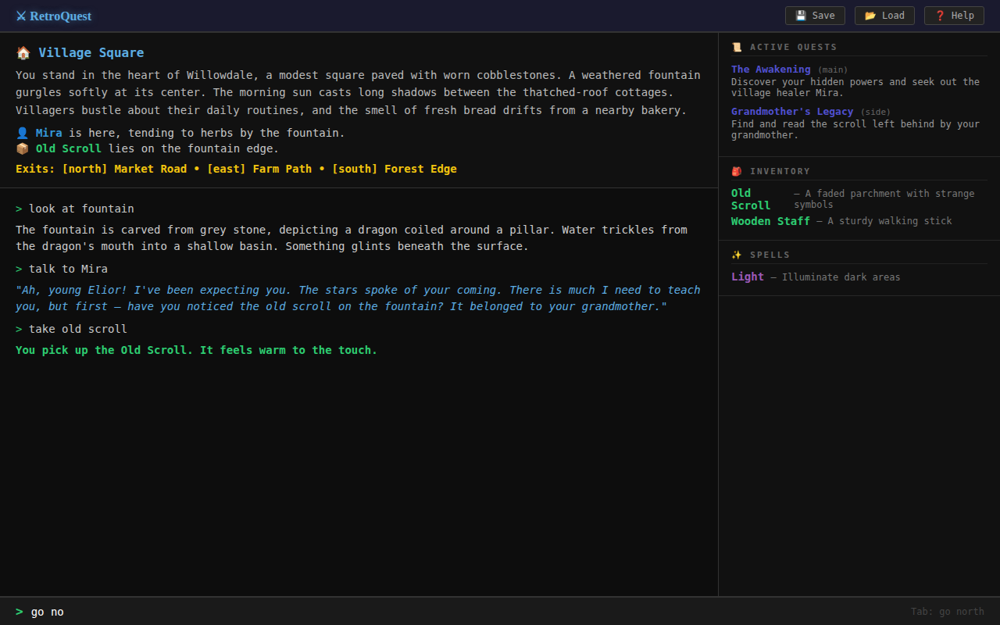
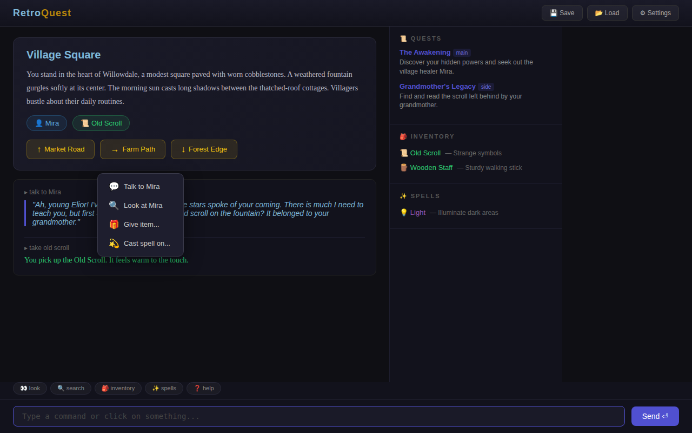
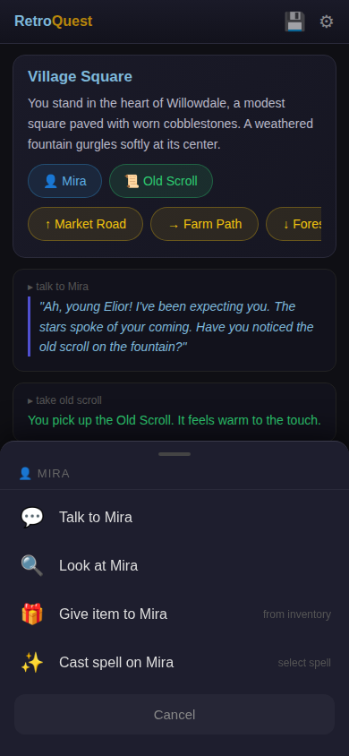
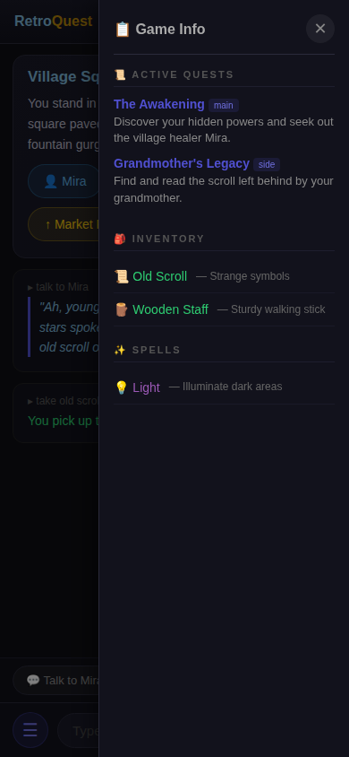
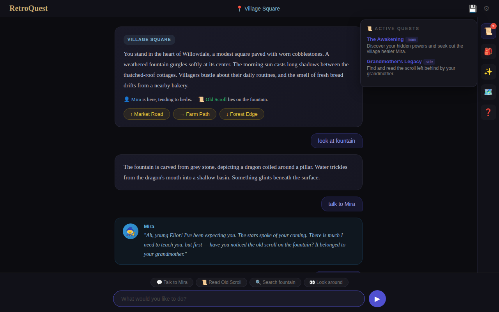

# Web Frontend Proposal for RetroQuest

This document presents three prototype designs for a web-based frontend for RetroQuest, along with tech stack recommendations and a final recommendation.

## Table of Contents

- [Current Architecture Analysis](#current-architecture-analysis)
- [Proposal A: Classic Terminal](#proposal-a-classic-terminal)
- [Proposal B: Point-and-Click Hybrid](#proposal-b-point-and-click-hybrid)
- [Proposal C: Storybook / Chat Style](#proposal-c-storybook--chat-style)
- [Interaction Design Comparison](#interaction-design-comparison)
- [Tech Stack Recommendations](#tech-stack-recommendations)
- [Final Recommendation](#final-recommendation)

---

## Current Architecture Analysis

The existing RetroQuest codebase has a clean separation between the game engine and UI layers:

- **Game Engine** (`engine/Game.py`, `engine/GameState.py`, `engine/CommandParser.py`) — handles all game logic, command parsing, room navigation, quests, inventory, and spells.
- **GameController** (`engine/textualui/GameController.py`) — a thin adapter that formats engine data for presentation. Its docstring explicitly notes it was "_kept intentionally thin; avoids UI dependencies so it can be reused by other front ends in future (e.g., web or curses)_."
- **Theme system** (`engine/theme.py`) — maps semantic tags like `[character_name]`, `[item_name]`, `[exits]` to style definitions, which can be translated to CSS classes.

This architecture makes it straightforward to add a web frontend: the game engine and controller remain as the backend, exposed via a lightweight API, with the web frontend consuming that API.

---

## Proposal A: Classic Terminal

**Design philosophy:** Faithful to the text-adventure heritage. A split-pane layout with a terminal-style main area and a persistent sidebar. Feels like a modern terminal emulator running a text adventure.



### Layout

| Area | Description |
|------|-------------|
| **Header** | Game title with Save/Load/Help buttons |
| **Room Panel** (top-left) | Current room description with themed characters, items, and exits |
| **Output Panel** (bottom-left) | Scrolling command history with `>` prompts and color-coded responses |
| **Sidebar** (right) | Active quests, inventory, and spells in collapsible sections |
| **Input Bar** (bottom) | Terminal-style `>` prompt with Tab autocomplete hint |

### Interaction Model

- **Keyboard-first**: Type commands in the input bar, press Enter to submit
- **Tab autocomplete**: Mirrors the existing Textual UI `NestedSuggester` — typing `go no` shows a ghost hint `go north` that completes on Tab
- **Command history**: Up/Down arrows recall previous commands
- **Mouse**: Sidebar panels are read-only; buttons in header for Save/Load/Help

### Strengths

- Closest to the existing Textual TUI — low friction for current players
- Monospace font preserves the retro aesthetic
- Very fast for experienced text-adventure players
- Simple to implement; most logic maps 1:1 from the Textual UI

### Weaknesses

- Intimidating for new players unfamiliar with text adventures
- No discoverability — players must know which commands exist
- Pure keyboard interaction may feel dated on mobile/touch devices

---

## Proposal B: Point-and-Click Hybrid

**Design philosophy:** Combines typed commands with clickable elements. Room entities (characters, items) and exits appear as interactive chips/buttons. Right-clicking or clicking an entity opens a context menu with relevant actions.



### Layout

| Area | Description |
|------|-------------|
| **Top Bar** | Branded header with navigation buttons |
| **Room Card** (top) | Room narrative in a card with clickable entity chips and exit buttons |
| **Context Menu** | Floating action menu when clicking an entity (Talk, Look, Give, Cast) |
| **Result Area** | Previous actions and their outcomes |
| **Sidebar** (right) | Quests, inventory, spells — items are hoverable/clickable |
| **Quick Actions** | Row of common command buttons (look, search, inventory, help) |
| **Input Bar** | Text input with Send button |

### Interaction Model

- **Click entities**: Clicking "👤 Mira" opens a context menu with actions (Talk to, Look at, Give item, Cast spell on)
- **Click exits**: Exit buttons directly navigate — clicking "↑ Market Road" sends `go north`
- **Quick-action bar**: One-click access to `look`, `search`, `inventory`, `spells`, `help`
- **Keyboard**: Full text input still available for power users
- **Inventory interaction**: Clicking inventory items could trigger `use`, `drop`, or `give` actions
- **Sidebar hover**: Hovering inventory/spell items shows tooltips with descriptions

### Strengths

- **Best discoverability** — new players can explore by clicking; no need to guess commands
- Dual input (mouse + keyboard) caters to both casual and experienced players
- Context menus present only valid actions for each entity
- Exit buttons make navigation intuitive and immediate

### Weaknesses

- More complex to implement — requires mapping entities to clickable elements
- Context menus need dynamic population based on game state
- Risk of feeling "cluttered" if room has many entities

### Proposal B on Handheld / Touch Devices

On mobile and tablet screens, Proposal B adapts with touch-native patterns that replace desktop interactions. The core layout remains — room card at top, results below, input at bottom — but every interactive element is redesigned for finger-sized tap targets and touch gestures.

#### Action Sheet (replaces context menu)

Tapping an entity chip (e.g., "👤 Mira") slides up a **bottom action sheet** — the standard mobile pattern for contextual actions. Each action row has generous 48px+ touch targets with clear icons and labels. A "Cancel" button at the bottom dismisses the sheet.



#### Side Drawer (replaces sidebar)

The desktop sidebar collapses into a **slide-over drawer** accessed via the ☰ hamburger button. A semi-transparent scrim covers the game area behind it. The drawer shows quests, inventory, and spells in vertically scrollable sections with touch-friendly row heights. Swiping right or tapping the ✕ button closes it.



#### Touch-Specific Adaptations

| Desktop Pattern | Mobile Adaptation |
|----------------|-------------------|
| Context menu on entity click | Bottom action sheet (slide-up) |
| Right sidebar (always visible) | Hamburger drawer (slide-over, on demand) |
| Hover tooltips on inventory/spells | Tap-to-expand item details |
| Quick-action bar (fixed row) | Horizontally swipeable suggestion chips |
| Tab autocomplete in input | Suggestion chips replace autocomplete (no physical keyboard by default) |
| Exit buttons in room card | Same — pill buttons with 44px+ tap targets |
| Text input + Enter | Text input + Send button (visible tap target) |

#### Key Touch Design Principles

- **Minimum 44×44px tap targets** on all interactive elements (Apple HIG / Material guideline)
- **Bottom-anchored actions** — action sheets, input bar, and suggestions all live at the bottom of the screen where thumbs naturally rest
- **Swipe gestures** — swipe down to dismiss action sheet, swipe right to close drawer
- **No hover states** — all hover-dependent interactions replaced with tap alternatives
- **Horizontal scroll for overflow** — exit buttons and suggestion chips scroll horizontally rather than wrapping to multiple lines

---

## Proposal C: Storybook / Chat Style

**Design philosophy:** The game unfolds as a flowing conversation between player and narrator. Inspired by modern chat interfaces — player commands appear as right-aligned bubbles, game responses as left-aligned story cards. Character dialogue gets special avatar-decorated bubbles.



### Layout

| Area | Description |
|------|-------------|
| **Top Bar** | Minimal: logo, current location badge, save/settings icons |
| **Story Flow** (center) | Scrolling chat-like feed with room cards, player bubbles, dialogue bubbles, and notification toasts |
| **Mini Sidebar** (right) | Icon-only sidebar that expands on click (quests, inventory, spells, map, help) |
| **Suggestion Chips** | Context-aware action suggestions above the input |
| **Input Bar** | Rounded chat-style input with send button |

### Interaction Model

- **Chat-style flow**: Each player command and game response is a distinct bubble in a scrolling conversation
- **Suggestion chips**: Dynamically generated based on current room context — e.g., "💬 Talk to Mira", "📜 Read Old Scroll", "🔍 Search fountain"
- **Inline exit buttons**: Exits appear as pill buttons within the room description card
- **Collapsible sidebar**: Icons-only by default; clicking an icon (📜, 🎒, ✨) expands a floating panel
- **Dialogue avatars**: Character dialogue gets special treatment with avatar icons and styled bubbles
- **Success/failure toasts**: Actions like picking up items show as notification-style bubbles

### Strengths

- **Most approachable** — feels like a modern chat app; zero learning curve
- Narrative immersion is strong; the story reads like a book
- Suggestion chips provide excellent discoverability without cluttering the UI
- Collapsible sidebar maximizes story area
- Distinct visual treatment for different response types (narration, dialogue, notifications)
- Mobile-friendly — single-column flow works on any screen size

### Weaknesses

- History can get very long — needs smart auto-scrolling and possibly a "new room" separator
- Room context scrolls out of view as the conversation grows (unlike Proposals A/B where the room panel is fixed)
- Suggestion chips require additional logic to generate context-aware actions

---

## Interaction Design Comparison

| Feature | A: Classic Terminal | B: Hybrid | C: Storybook |
|---------|:------------------:|:---------:|:------------:|
| Keyboard commands | ✅ Primary | ✅ Full | ✅ Full |
| Tab autocomplete | ✅ | ✅ | ✅ |
| Command history (↑↓) | ✅ | ✅ | ✅ |
| Clickable exits | ❌ | ✅ | ✅ |
| Clickable entities | ❌ | ✅ Context menu | ⚡ Suggestion chips |
| Quick-action buttons | ❌ | ✅ | ✅ Suggestion chips |
| Persistent room view | ✅ Fixed panel | ✅ Fixed card | ❌ Scrolls away |
| Mobile friendly | ⚠️ Passable | ✅ Action sheet + drawer | ✅ Excellent |
| New-player friendly | ⭐ | ⭐⭐⭐ | ⭐⭐⭐⭐ |
| Power-user efficiency | ⭐⭐⭐⭐ | ⭐⭐⭐ | ⭐⭐ |
| Implementation effort | Low | Medium | Medium |

---

## Tech Stack Recommendations

All options below follow the constraint that **everything executes in the frontend** — the backend is a plain HTTP server that serves static files only. The game engine runs entirely in the browser.

### Option 1: Pyodide (Python-in-Browser) + Vanilla JS / Alpine.js (Recommended)

| Layer | Technology | Rationale |
|-------|-----------|-----------|
| **Game Engine Runtime** | **Pyodide** (CPython compiled to WebAssembly) | Runs the existing Python game engine unmodified in the browser. No transpilation or rewrite needed. |
| **Frontend** | **HTML/CSS + Alpine.js** | Lightweight reactivity via HTML attributes; no build step. Alpine.js manages UI state and communicates with the Pyodide runtime. |
| **Styling** | **CSS custom properties** | Map the existing `theme.py` semantic tokens to CSS variables. |
| **Serving** | **Any static HTTP server** (e.g., `python -m http.server`, nginx, GitHub Pages) | Zero backend logic — just serve HTML, CSS, JS, and the `.whl` / `.py` files. |
| **Bundling** | **None** | No build step required. Pyodide loads Python packages at runtime. |

**How it works:** On page load, Pyodide boots the CPython interpreter in WebAssembly, then imports the existing `Game`, `GameController`, and Act modules directly. A thin JS bridge calls Python functions (e.g., `game.handle_input(command)`) and reads back results to update the DOM via Alpine.js reactive data.

**Pros:**
- **Reuses the existing Python engine as-is** — no rewrite or port required
- Stays in the Python ecosystem; game logic changes only need Python edits
- No build step, no Node.js toolchain
- Can be hosted on GitHub Pages or any static file host
- Alpine.js keeps the frontend simple and readable

**Cons:**
- ~15MB initial Pyodide download (cached after first load; can show a loading screen)
- `pygame` audio won't work in-browser — need Web Audio API replacements for sound effects
- Slight startup delay while Pyodide boots (~2-3 seconds on modern hardware)
- Pyodide's `pickle`-based save/load needs adaptation (use browser `localStorage` instead of filesystem)

### Option 2: JavaScript/TypeScript Rewrite + React or Vue

| Layer | Technology | Rationale |
|-------|-----------|-----------|
| **Game Engine** | **TypeScript** (full rewrite of Python engine) | Native browser execution; no WebAssembly overhead. |
| **Frontend** | **React** or **Vue 3** | Component-based UI, excellent for complex interactive panels (context menus, drawers, popups). |
| **Styling** | **Tailwind CSS** | Utility-first, rapid prototyping, consistent design tokens. |
| **State Management** | **Zustand** (React) or **Pinia** (Vue) | Lightweight state management for game state. |
| **Bundling** | **Vite** | Fast dev server, optimized production builds, outputs static files. |
| **Serving** | **Any static HTTP server** | Vite builds to a `dist/` folder of static assets. |

**How it works:** The entire Python game engine (`Game.py`, `GameState.py`, `CommandParser.py`, all Act modules, rooms, characters, quests, etc.) is rewritten in TypeScript. The frontend framework consumes the engine directly as imported modules.

**Pros:**
- Native browser performance; no WebAssembly overhead or large downloads
- Rich ecosystem for building complex UIs (context menus, animations, drag-and-drop inventory)
- TypeScript provides strong typing and IDE support
- Smaller bundle size than Pyodide approach

**Cons:**
- **Massive rewrite effort** — every Python module must be ported to TypeScript
- Two codebases to maintain (Python TUI + TypeScript web) or abandon the Python version
- Future game content changes require parallel edits in both languages
- Requires Node.js toolchain knowledge

### Option 3: Transcrypt (Python-to-JavaScript Transpiler) + Vanilla JS

| Layer | Technology | Rationale |
|-------|-----------|-----------|
| **Game Engine** | **Transcrypt** | Transpiles Python source to JavaScript at build time. Aims for near-1:1 Python-to-JS translation. |
| **Frontend** | **HTML/CSS + Vanilla JS** | Transcrypt-generated JS interacts with the DOM directly or via a thin wrapper. |
| **Bundling** | **Transcrypt CLI** (build step) | Produces `.js` output from `.py` source. |
| **Serving** | **Any static HTTP server** | Serve the transpiled JS + HTML/CSS. |

**How it works:** The Python game engine source is transpiled to JavaScript by Transcrypt at build time. The output JS is loaded in the browser like any other script. A JS wrapper bridges the transpiled engine to the HTML UI.

**Pros:**
- Write game logic in Python, run it as JavaScript — smaller download than Pyodide
- Faster startup than Pyodide (no WebAssembly boot)
- Single source of truth in Python

**Cons:**
- Transcrypt has limited Python standard library support — `pickle`, `os`, `pathlib` won't work
- Some Python patterns may not transpile cleanly (metaclasses, complex inheritance)
- Less mature ecosystem; debugging transpiled code is harder
- Build step required; adds toolchain complexity
- May need significant engine refactoring to avoid unsupported Python features

### Option 4: Brython (Python-in-Browser, lightweight)

| Layer | Technology | Rationale |
|-------|-----------|-----------|
| **Game Engine** | **Brython** | Lightweight Python interpreter written in JavaScript; runs Python source directly in the browser. |
| **Frontend** | **HTML/CSS** + Brython DOM bindings | Python code interacts with the DOM using Brython's `browser` module. |
| **Bundling** | **None** | Include `brython.js` via CDN or local file. Python files loaded at runtime. |
| **Serving** | **Any static HTTP server** | Serve HTML + Python source files. |

**How it works:** Similar to Pyodide but much lighter (~500KB vs ~15MB). Brython interprets Python source in JS at runtime. The game engine Python files are served as-is and executed in the browser.

**Pros:**
- Very small runtime (~500KB) — fast initial load
- No build step; Python source served directly
- Familiar Python syntax for DOM manipulation

**Cons:**
- Significantly slower execution than Pyodide (interpreted, not compiled to Wasm)
- Very limited standard library — many modules missing
- Less actively maintained than Pyodide
- Complex Python patterns may not be supported
- Would likely require engine modifications to work

---

## Final Recommendation

### UI Design: Proposal B (Point-and-Click Hybrid)

**Proposal B** strikes the best balance between discoverability and power:

1. **Easy to get started**: New players can click on characters, items, and exits without knowing any commands. The quick-action bar provides immediate access to common actions.
2. **Scales with expertise**: Experienced players can ignore the mouse entirely and type commands with full autocomplete support.
3. **Preserves the room context**: The fixed room card ensures players always see where they are and what's available, unlike the chat-style scrolling flow.
4. **Adapts to game complexity**: Context menus can dynamically show only valid actions per entity, reducing player confusion.

However, elements from **Proposal C** should be incorporated:
- **Suggestion chips** from Proposal C are excellent for discoverability and should replace or augment the quick-action bar
- **Dialogue avatar bubbles** from Proposal C should be used for character conversations to enhance immersion
- The **collapsible sidebar** concept from Proposal C could be offered as an option for smaller screens

### Tech Stack: Option 1 (Pyodide + Alpine.js)

This is recommended because:

1. **Reuses the existing Python engine as-is** — no rewrite, no transpilation; the same `Game.py`, `CommandParser.py`, and Act modules run directly in the browser via WebAssembly
2. **Static-file only deployment** — the backend is a plain HTTP server (or GitHub Pages); zero server-side logic
3. **No build step required** — static HTML/CSS/JS files plus Pyodide loading the Python packages at runtime; Alpine.js adds reactivity via HTML attributes without a bundler
4. **Low barrier to contribution** — game content authors only need to know Python; frontend is simple HTML + Alpine.js
5. **Future upgrade path** — if the UI grows complex enough, the JS bridge can be swapped for a React/Vue frontend while keeping the Pyodide engine layer unchanged

### Architecture Sketch

```
┌──────────────────────────────────────────────────┐
│                    Browser                        │
│                                                   │
│  ┌──────────────────────────────────────────────┐ │
│  │      HTML/CSS + Alpine.js Frontend           │ │
│  │   (Room Card, Sidebar, Input, Popups)        │ │
│  └──────────────┬───────────────────────────────┘ │
│                 │ JS ↔ Python bridge               │
│  ┌──────────────┴───────────────────────────────┐ │
│  │          Pyodide (CPython on Wasm)           │ │
│  │  ┌────────────────────────────────────────┐  │ │
│  │  │  GameController (existing, reused)     │  │ │
│  │  └──────────────┬─────────────────────────┘  │ │
│  │  ┌──────────────┴─────────────────────────┐  │ │
│  │  │  Game Engine (Game, GameState, etc.)   │  │ │
│  │  └────────────────────────────────────────┘  │ │
│  └──────────────────────────────────────────────┘ │
│                                                   │
│  localStorage ← save/load game state              │
│  Web Audio API ← sound effects / music            │
└──────────────────────────────────────────────────┘
          │
          │ HTTP (static files only)
          │
┌─────────┴────────────────────────────────────────┐
│  Static HTTP Server (nginx / GH Pages / etc.)    │
│  Serves: HTML, CSS, JS, .py files, audio assets  │
└──────────────────────────────────────────────────┘
```

### Next Steps

1. **Set up Pyodide loader** that boots the Python runtime and imports the game engine modules
2. **Create a JS ↔ Python bridge** that calls `GameController` methods and returns JSON-serializable results
3. **Build the Proposal B frontend** as static HTML/CSS/JS with Alpine.js for reactivity
4. **Translate `theme.py`** semantic tokens to CSS custom properties
5. **Implement clickable entities** by parsing room descriptions for character/item/exit tags
6. **Add context menus (desktop) / action sheets (mobile)** that map entity types to valid commands
7. **Wire up quest popups** triggered by polling the game state after each command
8. **Replace `pickle` save/load** with browser `localStorage` serialization
9. **Replace `pygame` audio** with Web Audio API for sound effects and music
10. **Add responsive CSS** with media queries for mobile action sheet and drawer patterns
